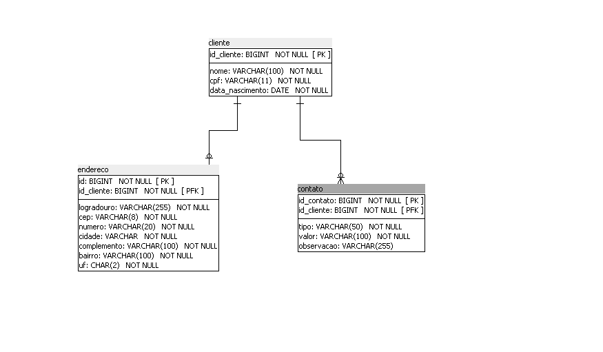

# 📇 Gestão de Clientes e Contatos - Desafio Muralis

Este projeto é uma solução Full-Stack desenvolvida como parte do desafio técnico para o Programa de Estágio da Muralis Tecnologia. A aplicação visa modernizar a gestão de contatos de uma empresa, permitindo o cadastro de clientes e seus respectivos contatos através de um sistema digital intuitivo e seguro.

## 🏛️ Estrutura do Projeto

A solução foi desenvolvida utilizando uma arquitetura monolítica baseada no padrão **MVC (Model-View-Controller)** com separação de responsabilidades em camadas (N-Tier Architecture):

* **Frontend (Visão):** Desenvolvido em HTML5, CSS3 e JavaScript puro. A interface consome os dados via requisições assíncronas (`fetch`) para a API REST.
* **Backend (Controle e Serviço):** Construído com Java e Spring Boot. Responsável por expor os endpoints REST, gerenciar as regras de negócio (validações de idade, unicidade de CPF) e orquestrar a comunicação com o banco de dados.
* **Persistência (Modelo):** Utiliza Spring Data JPA para o mapeamento objeto-relacional (ORM) e comunicação direta com o banco de dados relacional.
* **Tratamento de Exceções:** Implementação de um `GlobalExceptionHandler` (`@RestControllerAdvice`) para capturar erros de negócio e de integridade do banco, devolvendo mensagens padronizadas em JSON para o frontend.

## 🗄️ Modelagem do Banco de Dados

Abaixo está o Diagrama de Entidade-Relacionamento (DER) que ilustra a estrutura das tabelas e seus relacionamentos:



## 📂 File Tree

Abaixo está a estrutura de pacotes da aplicação:

```text
gestao-contatos/
├── entregaveis/                     # Contém o vídeo demonstrativo, a modelagem de dados e o fluxograma (draw.io)
├── src/
│   └── main/
│       ├── java/br/com/muralis/gestao_contatos/
│       │   ├── controller/          # Endpoints REST (ClienteController, ContatoController)
│       │   ├── dto/                 # Objetos de Transferência de Dados (Request/Response)
│       │   ├── entity/              # Entidades JPA (Cliente, Contato, Endereco)
│       │   ├── exception/           # Tratamento global de erros (GlobalExceptionHandler)
│       │   ├── repository/          # Interfaces do Spring Data JPA
│       │   ├── service/             # Lógica de negócio e validações (ClienteService, ContatoService)
│       │   └── GestaoContatosApplication.java # Classe principal do Spring Boot
│       │
│       └── resources/
│           ├── static/              # Arquivos do Frontend (index.html, style.css, script.js)
│           └── application.properties # Configurações de banco de dados e servidor
├── pom.xml                          # Gerenciador de dependências do Maven
└── SCRIPT.sql                       # Script de criação do banco de dados
```

## 💻 Principais Tecnologias Utilizadas
 
| Categoria | Tecnologia |
|---|---|
| Linguagem | Java 17 |
| Framework Backend | Spring Boot 4 |
| Persistência | Spring Data JPA / Hibernate |
| Banco de Dados | PostgreSQL |
| Validação | Hibernate Validator (Bean Validation) |
| Frontend | HTML5, CSS3, JavaScript |
| Integração de API Externa | ViaCEP (Preenchimento automático de endereço) |
 
---
 
## 📦 Dependências (Maven)
 
As principais dependências declaradas no `pom.xml` da aplicação são:
 
- **`spring-boot-starter-webmvc`** — Para construção da API REST e controle web.
- **`spring-boot-starter-data-jpa`** — Para persistência de dados.
- **`postgresql`** — Driver de conexão com o banco PostgreSQL.
- **`spring-boot-starter-validation`** — Para validações de DTOs (`@NotBlank`, `@CPF`, etc).
- **`spring-boot-devtools`** — Para hot-reloading e ganho de produtividade no desenvolvimento.
- **`lombok`** — Para redução de código boilerplate (Getters, Setters, Construtores).
 
---
 
## 🚀 Instruções para Execução
 
### Pré-requisitos
 
- Ter o **Java JDK 17** (ou superior) instalado.
- Ter o **PostgreSQL** rodando na máquina (porta padrão `5432`).
- **Opcional:** Maven instalado (caso não utilize a IDE para rodar).
 
### Passos para rodar a aplicação
 
**1. Clone o repositório:**
 
```bash
git clone https://github.com/Pgustavols/desafio-muralis.git
```

**2. Configure o Banco de Dados:**

Abra o arquivo `src/main/resources/application.properties` e certifique-se de que as configurações apontam para o seu banco PostgreSQL local:

```properties
spring.application.name=gestao-contatos

spring.datasource.url=jdbc:postgresql://localhost:5432/comercio_sa
spring.datasource.username=SEU_USUARIO
spring.datasource.password=SUA_SENHA

spring.datasource.driver-class-name=org.postgresql.Driver
spring.jpa.database-platform=org.hibernate.dialect.PostgreSQLDialect

spring.jpa.hibernate.ddl-auto=update

spring.jpa.show-sql=true
spring.jpa.properties.hibernate.format_sql=true
```

> **Observação:** Coloque o seu usuário e senha no lugar dos templates que estão em letras maiúsculas. Depois disso, crie o banco de dados `comercio_sa` no seu pgAdmin ou terminal do PostgreSQL antes de rodar a aplicação pela primeira vez. O Script para criação e população do banco de dados está na raiz do projeto, no arquivo [SCRIPT.sql](./SCRIPT.sql).

**3. Execute a aplicação:**

- **Via IDE:** Abra o projeto no IntelliJ e execute a classe `GestaoContatosApplication`.
- **Via Terminal (Linux/macOS):** Navegue até a raiz do projeto e execute:

```bash
./mvnw spring-boot:run
```

- **Via Terminal (Windows CMD):** Navegue até a raiz do projeto e execute:

```cmd
mvnw.cmd spring-boot:run
```

**4. Acesse o sistema:**

Abra o seu navegador e acesse: [http://localhost:8080](http://localhost:8080)

---

## ✅ Checklist de Implementação

Todos os requisitos propostos foram implementados com sucesso.

### Requisitos Funcionais (RF)

- [x] **RF01** — Cadastro de clientes (Nome, CPF, Data Nascimento, Endereço).
- [x] **RF02** — Edição dos dados de cliente.
- [x] **RF03** — Exclusão de cliente.
- [x] **RF04** — Listagem de todos os clientes.
- [x] **RF05** — Busca de cliente por Nome ou CPF (Busca Inteligente Híbrida).
- [x] **RF06** — Cadastro de contatos (Telefone, E-mail) vinculados ao cliente.
- [x] **RF07** — Edição de contatos.
- [x] **RF08** — Exclusão de contatos.
- [x] **RF09** — Listagem de contatos por cliente (Implementado via Janela Modal).

### Regras de Negócio (RN)

- [x] **RN01** — Campos Nome e CPF obrigatórios.
- [x] **RN02** — Campos Tipo e Valor de contato obrigatórios.
- [x] **RN03** — CPF único no sistema (Validação tratada via `IllegalArgumentException` e Banco).
- [x] **RN04** — Nome não vazio (Validado via `@NotBlank`).
- [x] **RN05** — Data de Nascimento válida.
- [x] **RN06** — Múltiplos contatos por cliente (Relacionamento `@OneToMany`).
- [x] **RN07** — Exclusão em cascata (Ao excluir cliente, contatos são removidos).
- [x] **RN08** — Validação rigorosa (Máscaras regex, Validação matemática do CPF, bloqueio de menores de 18 anos no Front e Backend).

---

## 📚 Referências

- [Documentação Oficial do Spring Boot](https://docs.spring.io/spring-boot/index.html)
- [API ViaCEP](https://viacep.com.br) — Para consulta de endereços.
- [MDN Web Docs](https://developer.mozilla.org) — Para referências de JavaScript e requisições Fetch.

---

## 🤖 Uso de Inteligência Artificial

Houve o uso de Inteligência Artificial atuando em um modelo de **Pair Programming** durante o desenvolvimento deste desafio.

- **Como foi utilizada:** A IA foi consultada para auxiliar na estruturação e no desenvolvimento lógico do frontend (HTML, CSS e JavaScript), incluindo a formulação de expressões regulares (Regex) avançadas para as máscaras dinâmicas de CPF e Telefone. No backend, foi utilizada para discutir e refinar as melhores práticas arquiteturais, especificamente na implementação limpa do `GlobalExceptionHandler` (`@RestControllerAdvice`) para padronização das respostas de erro JSON e tratamento rigoroso das regras de negócio (RN08). Adicionalmente, a IA auxiliou na geração da sintaxe para a modelagem do fluxograma da operação de cadastro no draw.io.
- **Qual o impacto:** O uso acelerou a construção da interface, a resolução de bugs de formatação visual (ex: comportamento da tecla backspace em máscaras) e a criação da documentação gráfica do projeto. Além disso, permitiu elevar o nível técnico da API com práticas consolidadas de mercado, resultando em uma aplicação mais estruturada, robusta e focada em uma excelente Experiência do Usuário (UX).
